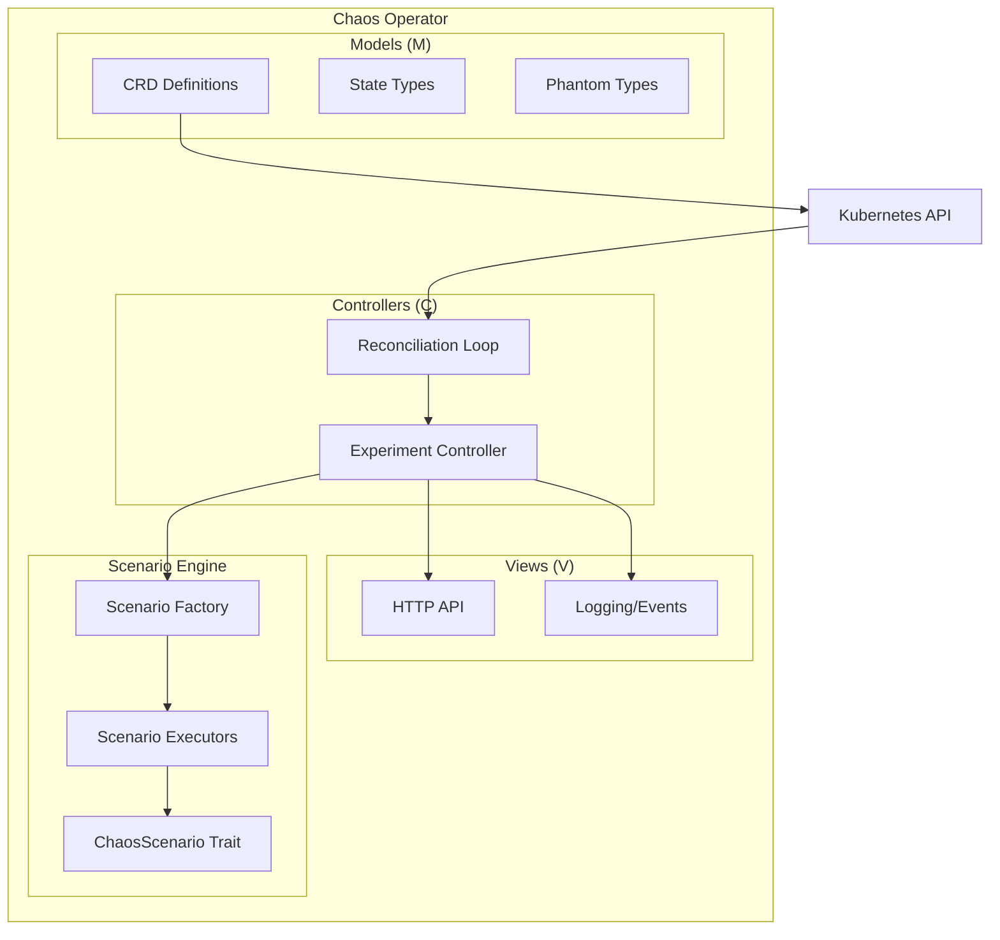

# Design Document

## Overview

The Chaos Operator is a Kubernetes operator built in Rust that manages chaos engineering experiments through a highly modular, type-safe architecture. The system follows MVC patterns with maximum extensibility, allowing new chaos scenarios to be added through trait implementations without core modifications.

## Architecture

### High-Level Architecture



### Type System Design

The operator uses phantom types and type states to ensure compile-time safety:

```rust
// Phantom types for experiment states
struct Pending;
struct Running;
struct Completed;
struct Failed;

// Type-safe experiment wrapper
struct Experiment<State> {
    spec: ExperimentSpec,
    _state: PhantomData<State>,
}
```

## Components and Interfaces

### 1. Models Module (`src/models/`)

**File Structure:**
- `mod.rs` - Module exports
- `chaos_experiment.rs` - ChaosExperiment CRD definition
- `scenario_types.rs` - Chaos scenario type definitions
- `state_machine.rs` - Type-safe state machine implementation
- `identifiers.rs` - Strongly typed ID wrappers

**Core Types:**``
`rust
// Strongly typed identifiers
#[derive(Debug, Clone, PartialEq, Eq, Hash, Serialize, Deserialize)]
pub struct ExperimentId(String);

#[derive(Debug, Clone, PartialEq, Eq, Hash, Serialize, Deserialize)]
pub struct PodId(String);

#[derive(Debug, Clone, PartialEq, Eq, Hash, Serialize, Deserialize)]
pub struct NodeId(String);

// ChaosExperiment CRD
#[derive(CustomResource, Deserialize, Serialize, Clone, Debug, JsonSchema)]
#[kube(group = "chaos.io", version = "v1", kind = "ChaosExperiment")]
pub struct ChaosExperimentSpec {
    pub scenario: ScenarioType,
    pub target: TargetSpec,
    pub duration: Duration,
    pub parameters: serde_json::Value,
}
```

### 2. Controllers Module (`src/controllers/`)

**File Structure:**
- `mod.rs` - Module exports and controller registration
- `experiment_controller.rs` - Main reconciliation logic
- `reconciler.rs` - Kubernetes reconciliation loop
- `state_manager.rs` - Experiment state management

**Core Traits:**
```rust
#[async_trait]
pub trait ExperimentController {
    async fn reconcile(&self, experiment: ChaosExperiment) -> Result<Action>;
    async fn cleanup(&self, experiment: ChaosExperiment) -> Result<()>;
}

#[async_trait]
pub trait StateManager<T> {
    async fn transition_to<U>(&self, experiment: Experiment<T>) -> Result<Experiment<U>>;
    async fn get_current_state(&self, id: &ExperimentId) -> Result<ExperimentState>;
}
```

### 3. Views Module (`src/views/`)

**File Structure:**
- `mod.rs` - Module exports
- `api_handlers.rs` - HTTP API endpoints using actix-web
- `event_publisher.rs` - Kubernetes event publishing
- `metrics.rs` - Metrics exposition

**API Design:**
```rust
// HTTP API endpoints
#[get("/experiments")]
async fn list_experiments() -> Result<HttpResponse>;

#[post("/experiments")]
async fn create_experiment(experiment: Json<ChaosExperimentSpec>) -> Result<HttpResponse>;

#[get("/experiments/{id}")]
async fn get_experiment(path: Path<ExperimentId>) -> Result<HttpResponse>;
```

### 4. Scenario Engine (`src/scenarios/`)

**File Structure:**
- `mod.rs` - Scenario registration and factory
- `traits.rs` - ChaosScenario trait definition
- `pod_killer.rs` - Pod termination scenario
- `network_delay.rs` - Network latency injection
- `cpu_stress.rs` - CPU stress scenario
- `factory.rs` - Scenario factory implementation

**Core Trait:**
```rust
#[async_trait]
pub trait ChaosScenario: Send + Sync {
    fn scenario_type(&self) -> ScenarioType;
    async fn validate(&self, spec: &ChaosExperimentSpec) -> Result<()>;
    async fn execute(&self, spec: &ChaosExperimentSpec) -> Result<ExecutionResult>;
    async fn cleanup(&self, spec: &ChaosExperimentSpec) -> Result<()>;
}
```

## Data Models

### ChaosExperiment CRD Structure

```yaml
apiVersion: chaos.io/v1
kind: ChaosExperiment
metadata:
  name: pod-killer-test
spec:
  scenario: PodKiller
  target:
    namespace: default
    labelSelector:
      app: test-app
  duration: 300s
  parameters:
    killPercentage: 50
    gracePeriod: 30s
```

### State Machine

```rust
pub enum ExperimentState {
    Pending,
    Validating,
    Running,
    Completed,
    Failed,
    Cancelled,
}

// Type-safe transitions
impl From<Experiment<Pending>> for Experiment<Running> {
    fn from(exp: Experiment<Pending>) -> Self {
        Experiment {
            spec: exp.spec,
            _state: PhantomData,
        }
    }
}
```

## Error Handling

### Error Types

```rust
#[derive(Debug, thiserror::Error)]
pub enum ChaosError {
    #[error("Kubernetes API error: {0}")]
    KubernetesError(#[from] kube::Error),
    
    #[error("Scenario validation failed: {0}")]
    ValidationError(String),
    
    #[error("Experiment execution failed: {0}")]
    ExecutionError(String),
    
    #[error("Agent communication failed: {0}")]
    AgentError(#[from] reqwest::Error),
}

pub type Result<T> = std::result::Result<T, ChaosError>;
```

### Error Recovery

- Exponential backoff for agent communication failures
- Automatic retry for transient Kubernetes API errors
- Graceful degradation when scenarios fail
- Comprehensive error logging with context

## Testing Strategy

### Unit Testing
- Mock implementations for all external dependencies
- Property-based testing for state machine transitions
- Comprehensive scenario validation testing

### Integration Testing
- In-cluster testing with kind/minikube
- End-to-end experiment execution
- API endpoint testing with test clusters

### Type Safety Testing
- Compile-time verification of state transitions
- Phantom type correctness validation
- CRD schema validation testing## Exte
nsibility Design

### Adding New Chaos Scenarios

To add a new chaos scenario, developers only need to:

1. **Create scenario implementation:**
```rust
pub struct NetworkPartitionScenario;

#[async_trait]
impl ChaosScenario for NetworkPartitionScenario {
    fn scenario_type(&self) -> ScenarioType {
        ScenarioType::NetworkPartition
    }
    
    async fn validate(&self, spec: &ChaosExperimentSpec) -> Result<()> {
        // Validation logic
    }
    
    async fn execute(&self, spec: &ChaosExperimentSpec) -> Result<ExecutionResult> {
        // Execution logic
    }
    
    async fn cleanup(&self, spec: &ChaosExperimentSpec) -> Result<()> {
        // Cleanup logic
    }
}
```

2. **Register in factory:**
```rust
// Automatic registration through inventory crate
inventory::submit! {
    ScenarioRegistration::new(ScenarioType::NetworkPartition, || Box::new(NetworkPartitionScenario))
}
```

### Plugin Architecture

The scenario factory uses dynamic registration:

```rust
pub struct ScenarioFactory {
    scenarios: HashMap<ScenarioType, Box<dyn Fn() -> Box<dyn ChaosScenario>>>,
}

impl ScenarioFactory {
    pub fn create_scenario(&self, scenario_type: ScenarioType) -> Result<Box<dyn ChaosScenario>> {
        self.scenarios
            .get(&scenario_type)
            .ok_or(ChaosError::UnknownScenario(scenario_type))?()
            .map(|factory| factory())
    }
}
```

## Future Istio Integration

### Architecture Preparation

The design includes extension points for Istio integration:

```rust
#[async_trait]
pub trait ServiceMeshProvider: Send + Sync {
    async fn inject_fault(&self, config: FaultConfig) -> Result<()>;
    async fn remove_fault(&self, config: FaultConfig) -> Result<()>;
}

pub struct IstioProvider {
    client: IstioClient,
}

#[async_trait]
impl ServiceMeshProvider for IstioProvider {
    async fn inject_fault(&self, config: FaultConfig) -> Result<()> {
        // Istio-specific fault injection
    }
    
    async fn remove_fault(&self, config: FaultConfig) -> Result<()> {
        // Istio-specific fault removal
    }
}
```

### Service Mesh Scenarios

Future Istio scenarios will implement the same `ChaosScenario` trait:

```rust
pub struct IstioTrafficSplitScenario {
    provider: Arc<dyn ServiceMeshProvider>,
}

#[async_trait]
impl ChaosScenario for IstioTrafficSplitScenario {
    // Implementation using ServiceMeshProvider
}
```

## Implementation Phases

### Phase 1: Core Infrastructure (MVP)
- Basic MVC structure
- CRD definitions
- Type-safe state machine
- Simple print-based scenario execution
- Kubernetes reconciliation loop

### Phase 2: Scenario Engine
- ChaosScenario trait implementation
- Basic scenarios (pod killer, CPU stress)
- Scenario factory and registration
- Agent communication framework

### Phase 3: Advanced Features
- HTTP API endpoints
- Comprehensive error handling
- Metrics and observability
- Advanced scenarios

### Phase 4: Service Mesh Integration
- Istio provider implementation
- Service mesh scenarios
- Advanced networking chaos

## Configuration Management

### Operator Configuration

```rust
#[derive(Debug, Deserialize)]
pub struct OperatorConfig {
    pub namespace: String,
    pub reconcile_interval: Duration,
    pub agent_timeout: Duration,
    pub max_concurrent_experiments: usize,
    pub log_level: String,
}
```

### Runtime Configuration

- Environment variable support
- ConfigMap-based configuration
- Dynamic configuration updates
- Validation and defaults

This design ensures maximum extensibility while maintaining type safety and clean architecture patterns. The modular structure allows for easy testing, maintenance, and feature additions.